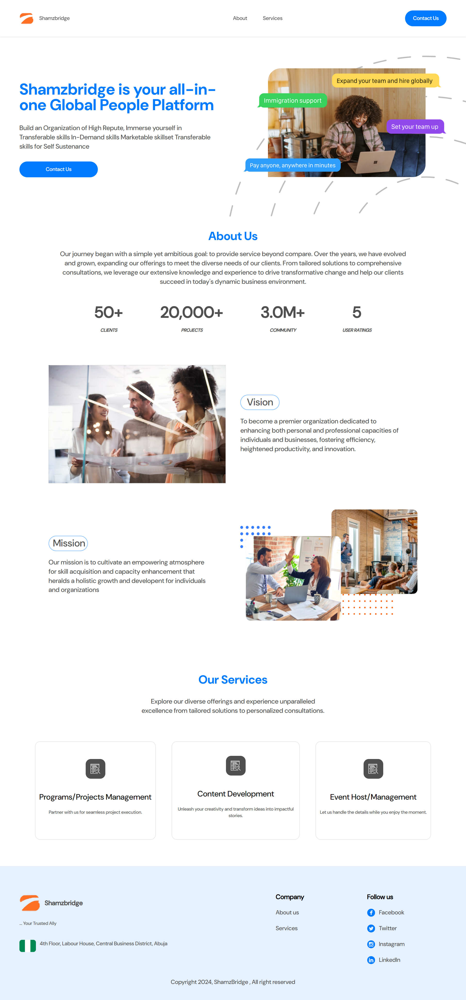

This is a [Next.js](https://nextjs.org/) project bootstrapped with [`create-next-app`](https://github.com/vercel/next.js/tree/canary/packages/create-next-app).

This is a website for secSystem

## Table of contents

- [shamsBridge](#shamsBridge)
  - [Screenshot](#screenshot)
  - [Links](#links)
- [Author](#author)
- [Acknowledgments](#acknowledgments)

### shamsBridge

Users should be able to:

- View the optimal layout for the site depending on their device's screen size

### Screenshot

### Links

- Solution URL1: [https://github.com/Dexie14/shamzbridgeLanding](https://github.com/Dexie14/shamzbridgeLanding)

## Author

- Github - [@Dexie14](https://github.com/Dexie14)
- Twitter - [@adeluadeoniye14](https://www.twitter.com/adeluadeoniye14)

## Acknowledgments

🙂🙂
